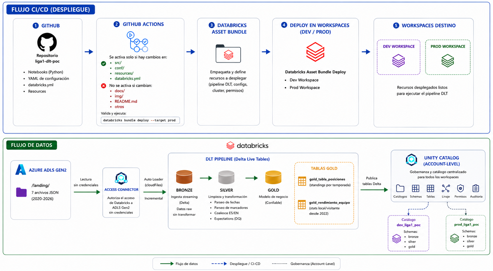
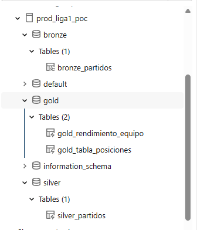

# Liga 1 DLT POC

POC de ingeniería de datos sobre estadísticas históricas de la **Liga 1 Peruana (2020–2026)** usando **Delta Live Tables (Spark Declarative Pipelines)** con arquitectura medallion Bronze → Silver → Gold, desplegado con **Databricks Asset Bundles**.

**Stack:** Python · Azure ADLS Gen2 · Azure Databricks · Delta Live Tables · Unity Catalog · Databricks Asset Bundles · GitHub Actions

---

## Arquitectura



---

## ¿Qué demuestra este POC?

| Concepto | Implementación |
|---|---|
| **Spark Declarative Pipelines (DLT)** | Pipeline declarativo con `@dlt.table` — Databricks gestiona orden, reintentos e incremental |
| **Auto Loader** | Ingesta incremental desde ADLS con `cloudFiles` |
| **Data Quality** | Expectations con `@dlt.expect_all` — validación declarativa en Silver y Gold |
| **Schema Evolution** | 7 archivos con esquemas de 5 a 69 columnas manejados automáticamente |
| **Asset Bundles** | Pipeline como código — desplegado con `databricks bundle deploy` |
| **CI/CD dev → prod** | Push a `develop` despliega en dev · Merge a `main` despliega en prod via GitHub Actions |
| **Unity Catalog** | Catálogos `dev_liga1_poc` y `prod_liga1_poc` con schemas bronze/silver/gold |
| **Parametrización YAML** | Schema, renombres, mapeo EN↔ES y expectations definidos en `conf/` |

---

## Pipeline DLT — Grafo de ejecución


4 tablas · 0 errores · Expectations cumplidas en Silver y Gold

---

## Unity Catalog — prod_liga1_poc



---

## ¿Qué preguntas responde?

Las tablas Gold son consumidas directamente desde **Databricks Genie** sin SQL:

### gold_tabla_posiciones — Standings 2020–2026

**¿Cuál fue la tabla de posiciones de la temporada 2024?**


**¿Qué equipo acumuló más puntos sumando todas las temporadas 2020–2026?**


**¿Cómo evolucionó el rendimiento de un equipo temporada a temporada?**


### gold_rendimiento_equipo — Stats local/visitante 2022–2026

**¿Cómo se compara el rendimiento local vs visitante de Alianza Lima en 2023?**


**¿Cuál es la evolución de disparos a puerta por equipo?**


**¿Qué equipos cometen más faltas jugando de visitante?**


---

## Estructura del repositorio

```
liga1-dlt-poc/
├── databricks.yml                    ← Asset Bundle: variables, targets dev + prod
├── resources/
│   └── liga1_pipeline.yml            ← Definición del pipeline DLT (cluster, config, libraries)
├── conf/
│   └── estadisticas_partidos.yml     ← Schema, renombres, EN↔ES fallback, expectations, Gold config
├── src/
│   ├── utils/utils_poc.py            ← Funciones compartidas (get_yaml_config, sanitize, log)
│   ├── bronze/bronze_partidos.py     ← @dlt.table · Auto Loader · explode JSON
│   ├── silver/silver_partidos.py     ← @dlt.table · limpieza · @dlt.expect_all
│   └── gold/gold_partidos.py         ← @dlt.table · standings · rendimiento local/visit
├── .github/workflows/
│   └── deploy-prod.yml               ← Merge main → catalog setup + bundle deploy + pipeline run
├── docs/
│   ├── 01_funcional.md               ← Qué hace el proyecto, datos, arquitectura medallion
│   └── 02_arquitectura.md            ← Infraestructura Azure, Unity Catalog, DAB, CI/CD
└── img/                              ← Capturas del pipeline, catalog y Genie dashboard
```

---

## Documentación

| Documento | Contenido |
|---|---|
| [Funcional](docs/01_funcional.md) | Qué hace el proyecto, datos, arquitectura medallion, parametrización |
| [Arquitectura](docs/02_arquitectura.md) | Infraestructura Azure, permisos, Unity Catalog, CLI, Asset Bundles, CI/CD |

---

*Desarrollado por Oscar García Del Águila — Lima, Perú · 2026*
